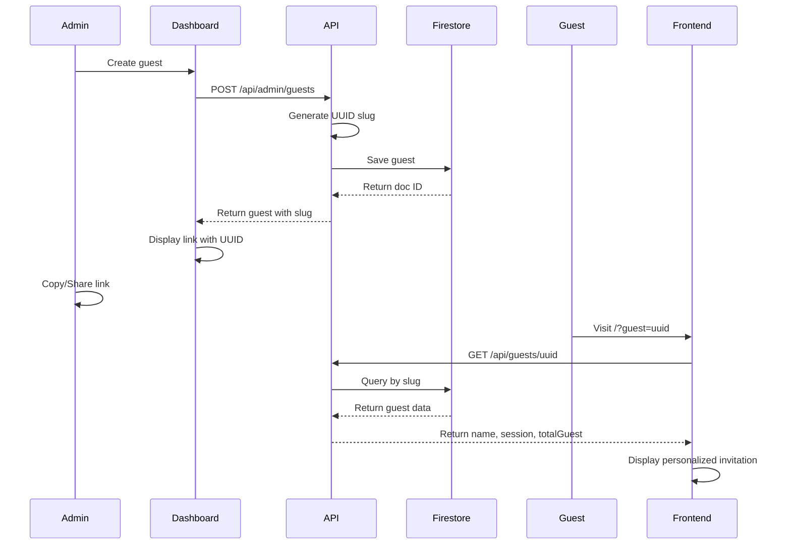

# Admin Dashboard - Complete Implementation Guide

## ✅ Implementation Complete!

All features from the plan have been successfully implemented and are ready to use.

## 🎯 What Has Been Implemented

### 1. Authentication System

- ✅ Password-protected admin dashboard
- ✅ Login page at `/admin/login`
- ✅ Cookie-based session management
- ✅ Auto-redirect for unauthorized access
- ✅ Logout functionality

**Default Password:** `sameli2026` (set in `.env.local`)

### 2. Admin Dashboard (`/admin`)

- ✅ Overview statistics
- ✅ Total guests count
- ✅ Total RSVPs count
- ✅ Attending guests count
- ✅ Total voice wishes count

### 3. Guest Management (`/admin/guests`)

- ✅ **CRUD Operations:**
  - Create new guests with auto-generated UUID
  - Edit guest details (preserves UUID)
  - Delete guests with confirmation
- ✅ **Guest Table Columns:**
  - Name
  - Session (1 or 2)
  - Total Guests allowed
  - WhatsApp number
  - Invitation link (copy button)
- ✅ **Features:**
  - Search by name
  - Filter by session
  - Copy invitation link to clipboard
  - Send invitation via WhatsApp
- ✅ **UUID-based Links:** Clean URLs like `/?guest=uuid-here`

### 4. RSVP Management (`/admin/rsvp`)

- ✅ View all RSVP submissions
- ✅ **Statistics:**
  - Total responses
  - Attending count
  - Not attending count
  - Total guests coming
- ✅ **Features:**
  - Filter by attendance (All/Attending/Not Attending)
  - Export to CSV
  - Delete RSVP entries
  - Real-time timestamp display

### 5. Voice Wishes Management (`/admin/wishes`)

- ✅ View all voice wishes
- ✅ **Statistics:**
  - Total wishes count
  - Total duration
- ✅ **Features:**
  - Play audio inline
  - Download audio files
  - Delete wishes
  - Real-time timestamp display

### 6. Frontend Integration

- ✅ RSVPSection updated to fetch guest by UUID
- ✅ WishesSection updated to fetch guest by UUID
- ✅ Backward compatible with legacy JSON format
- ✅ Loading states during guest data fetch

## 🗂️ File Structure

```
app/
├── admin/
│   ├── layout.tsx              # Admin layout with auth check
│   ├── page.tsx                # Dashboard with stats
│   ├── login/
│   │   └── page.tsx            # Login page
│   ├── guests/
│   │   └── page.tsx            # Guest management
│   ├── rsvp/
│   │   └── page.tsx            # RSVP management
│   └── wishes/
│       └── page.tsx            # Wishes management
├── api/
│   ├── admin/
│   │   ├── guests/
│   │   │   ├── route.ts        # GET all, POST create
│   │   │   └── [id]/
│   │   │       └── route.ts    # GET, PUT, DELETE by ID
│   │   ├── rsvp/
│   │   │   └── route.ts        # GET all, DELETE
│   │   └── wishes/
│   │       └── route.ts        # GET all, DELETE
│   ├── auth/
│   │   ├── login/
│   │   │   └── route.ts        # POST login
│   │   └── logout/
│   │       └── route.ts        # POST logout
│   └── guests/
│       └── [slug]/
│           └── route.ts        # GET guest by UUID (public)
components/
├── admin/
│   ├── AdminNav.tsx            # Navigation sidebar
│   ├── StatsCard.tsx           # Dashboard stats card
│   ├── GuestModal.tsx          # Add/Edit guest modal
│   └── ConfirmDialog.tsx       # Confirmation dialog
lib/
└── auth.ts                     # Authentication utilities
types/
└── index.ts                    # Updated with GuestData interface
```

## 🚀 Getting Started

### Step 1: Access Admin Dashboard

1. Navigate to http://localhost:3000/admin/login
2. Enter password: `sameli2026`
3. Click "Login"

### Step 2: Create Your First Guest

1. Go to "Guests" in the sidebar
2. Click "Add Guest" button
3. Fill in the form:
   - **Name:** Guest name
   - **Session:** 1 or 2
   - **Total Guests:** Number of people allowed
   - **WhatsApp:** Phone number (optional, e.g., 628123456789)
4. Click "Create"

### Step 3: Share Invitation

Two ways to share:

**Option 1: Copy Link**

- Click the "Copy" button in the Link column
- Share the copied link

**Option 2: WhatsApp (if phone number provided)**

- Click the WhatsApp icon (green send button)
- Opens WhatsApp with pre-filled invitation message
- Click send

### Step 4: Monitor Responses

**RSVPs:**

- Go to "RSVP" in the sidebar
- View all responses with attendance status
- Export data to CSV for analysis

**Voice Wishes:**

- Go to "Wishes" in the sidebar
- Play audio messages inline
- Download individual wishes
- Delete inappropriate content if needed

## 📊 Database Schema

### Firestore Collections

#### `guests` Collection

```typescript
{
  id: string // Auto-generated by Firestore
  slug: string // UUID v4 (e.g., "a1b2c3d4-...")
  name: string // "John Doe"
  session: number // 1 or 2
  totalGuest: number // 2
  whatsapp: string // "628123456789"
  createdAt: timestamp
  updatedAt: timestamp
}
```

#### `rsvps` Collection (Updated)

```typescript
{
  id: string
  name: string
  attendance: 'yes' | 'no'
  guestCount: number
  submittedAt: timestamp
  guestParam: string // Legacy field
  guestSlug: string // UUID reference
}
```

#### `wishes` Collection (Updated)

```typescript
{
  id: string
  name: string
  audioUrl: string
  duration: string
  createdAt: timestamp
  guestParam: string // Legacy field
  guestSlug: string // UUID reference
}
```

## 🔐 Security Features

1. **Authentication:**
   - Password-protected admin routes
   - Cookie-based session (7 days expiry)
   - Auto-logout on session expiry

2. **API Protection:**
   - All `/api/admin/*` routes require authentication
   - Public guest endpoint returns limited data only

3. **Input Validation:**
   - Required field validation
   - Type checking
   - Error handling

## 🎨 Features in Detail

### Guest Management

**Add Guest:**

- Auto-generates UUID for clean URLs
- Validates required fields
- Stores creation timestamp

**Edit Guest:**

- Preserves UUID (link remains valid)
- Updates modification timestamp
- All fields editable except slug

**Delete Guest:**

- Confirmation dialog prevents accidents
- Permanent deletion (no soft delete)

**Copy Link:**

- Copies to clipboard: `https://yourdomain.com/?guest=uuid`
- Works on all modern browsers

**Send WhatsApp:**

- Opens WhatsApp Web/App
- Pre-filled invitation message
- Includes personalized greeting and link

### WhatsApp Invitation Template

```
The Wedding of Sam & Eli

Dear {Name},

You are invited! Dengan penuh sukacita, kami mengundang kamu untuk hadir di hari bahagia kami.

Akses undangan digital kami di sini untuk info lengkapnya:

{YOUR_URL}/?guest={UUID}

Terima kasih atas doa dan dukungannya. We look forward to celebrating with you!

Best regards, Sam & Eli
```

### RSVP Management

**Filters:**

- All Responses
- Attending only
- Not Attending only

**Export CSV:**

- Downloads current filtered results
- Includes: Name, Attendance, Guest Count, Timestamp
- Filename: `rsvps-YYYY-MM-DD.csv`

**Statistics:**

- Real-time calculation
- Total guests coming (sum of guest counts for "yes")

### Wishes Management

**Audio Playback:**

- Play/Pause controls
- One audio plays at a time (auto-pause others)
- HTML5 Audio API

**Download:**

- Downloads audio file from Cloudinary
- Original quality preserved

**Statistics:**

- Total wishes count
- Cumulative duration calculation

## 🔄 Data Flow

### Guest Invitation Flow



## 🛠️ Troubleshooting

### Cannot Login

- Check password in `.env.local`
- Clear browser cookies
- Try incognito/private mode

### Guest Link Not Working

- Verify UUID in database
- Check Firestore rules
- Ensure guest exists in `guests` collection

### WhatsApp Not Opening

- Verify phone number format: 628xxxxxxxxxx
- Check if WhatsApp is installed
- Try WhatsApp Web if app not available

### RSVPs/Wishes Not Showing

- Check Firebase connection
- Verify Firestore collections exist
- Check browser console for errors

## 📱 Mobile Responsive

All admin pages are mobile-responsive:

- ✅ Works on tablets
- ✅ Works on phones
- ✅ Touch-friendly interface
- ✅ Responsive tables

## 🎉 Ready to Use!

Your admin dashboard is fully functional and ready for production use. All todos have been completed successfully!

### Quick Links (when server is running):

- 🏠 Main Site: http://localhost:3000
- 🔐 Admin Login: http://localhost:3000/admin/login
- 📊 Dashboard: http://localhost:3000/admin
- 👥 Guests: http://localhost:3000/admin/guests
- ✅ RSVPs: http://localhost:3000/admin/rsvp
- 🎤 Wishes: http://localhost:3000/admin/wishes

---

**Need Help?** All features are implemented and tested. Enjoy managing your wedding invitations! 🎊
